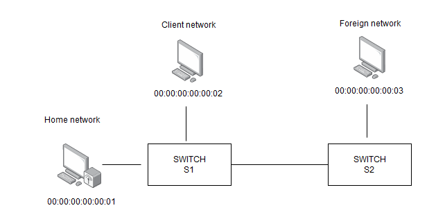
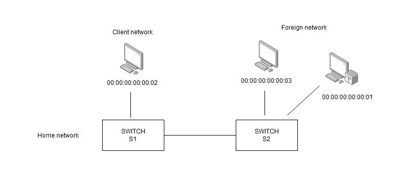

# Tunneling using P4 (right now it is more like creating custom topology)
Authors: Piotr Pasternak, Anna Brytańczyk

## 0) Prerequirements
Laboratory was tested on Ubuntu 20.04.
### a. Docker
Make sure you have [Docker](https://docs.docker.com/get-docker/
) installed on your system.
### b. Clone repository
Clone this repository and move to its main directory:

`$ git clone --recursive https://github.com/ZGES/p4_tunneling.git`

`$ cd p4_tunneling`

### c. p4app
In this laboratory we will use [p4app](https://github.com/p4lang/p4app), a tool for running P4 programs on virtualized environment (Docker containers with Mininet and BMV2). It also has many examples of posible configurations.

p4app expects directory ending with .p4app. There should be placed p4app.json file, containing full configuration of the running environment.

To run app use script:

`./p4app/p4app run tunneling.p4app`

If it is first time you use p4app the docker images with p4c and minnet will be created.

## 1) Defining home topology

To show how mobile ip works we prepared two topologies. 
In first scenario we will focus on tho one where our mobile host is in its Home network.

### a. Set ip addresses
Open tunneling.p4app/hometopo.py and set ip for each host. You can chose them arbitrarily but remember that each host is in different network.

### b. Configure topology
Now edit tunneling.p4app/p4app.json. We will explain what each json entry mean:
* program - it is program that is defining how switches in the topology are working
* language - P4 language version in our case it is p4-16
* targets - p4app allow us to define many different topologies in the configuration file and we specify them here. We have two topologies:
    * home (configuring now)
    * foreign (we will focus on it in second task)
* use - specyfing "backend". In our case 'multiswitch' allow us to have more than one switch. There is also 'mininet' which provide star topology.
* topo_module - file with custom topology. It should implement the class CustomAppTopo.
* links - specifing connections between hosts and switches. We could put them in topology file, but as we don't have custom controller, p4app wouldn't see devices and as a result we had to move links to json file
* auto-control-plane - specify if auto control plane should work. If value is false we have to provide our own control plane
* cli - allow us to stay in mininet after we lauch the app

Now fill missing program and create links to create topology as in the above picture.

You can test this topology by runing

`./p4app/p4app run tunneling.p4app home` 

Then in mininet console execute

`mininet> pingall`

If all hosts are pinging everything is ok. If not try to ping hosts one by one i.e.

`mininet> h1 ping h2`
## 2) Foreign topology

In this scenario ur mobile host went on the business trip to the Foreign network.

### a. Set ip addresses, again!
Now edit tunneling.p4app/foreigntopo.py and set ip adresses for hosts. Hosts in Client network (Host2) and the one which was in Foreign network (Host3) should have the same ip adresses as in previous example.

### b. Configure foreign topology
Basing on home topology configure the foreign one.
Then to check corectness of your solution run

`./p4app/p4app run tunneling.p4app foreign`

and in mininet ping all hosts.

## 3) Tunelling
This task would be a case if we know how to pass configuration to switches in multiswitch backend.